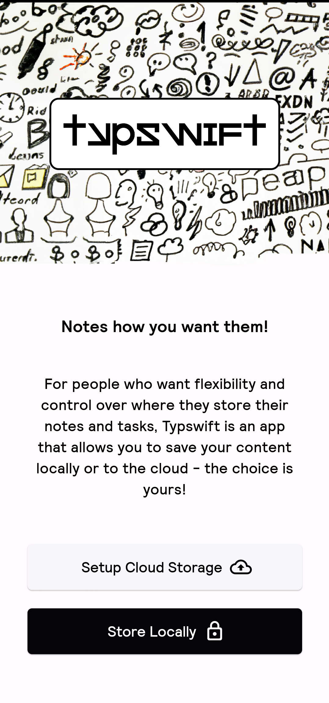
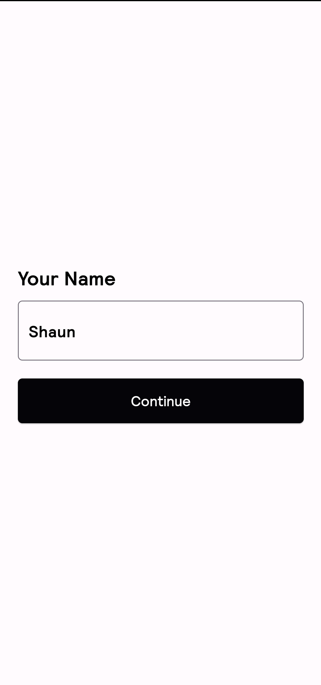
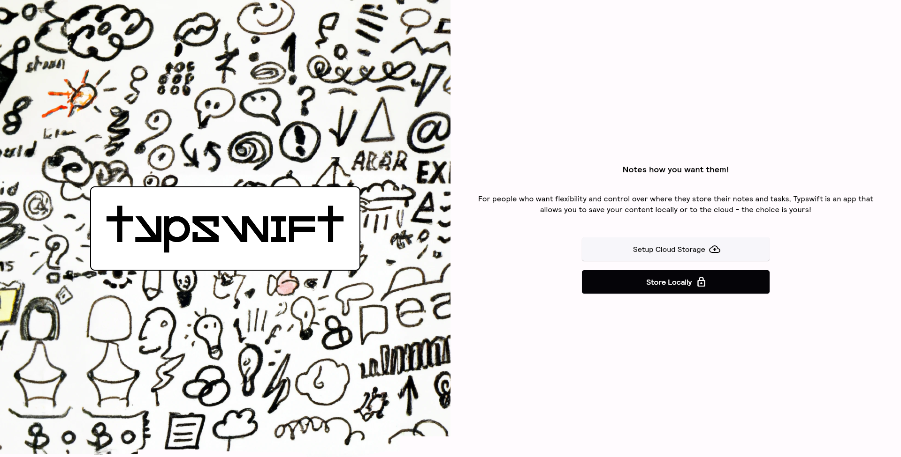

 

# Typswift
Typswift is an application designed to give you flexibility and control over where you store your notes and tasks. It allows you to save your content locally or to the cloud - the choice is yours!


## Tagline

Notes how you want them!

## Features

- Set up the app to use locally or cloud storage
- Create notes and tasks

## Screenshots

Here are some screenshots of Typswift on mobile and desktop:

### Mobile:
&nbsp;&nbsp;&nbsp;&nbsp;

### Desktop:
<br>


## Development Status

Please note that this app is currently in development. It is not ready for use. Contributions are welcome.

## Getting Started

These instructions will get you a copy of the project up and running on your local machine for development and testing purposes.

### Prerequisites

- Flutter SDK
- Dart SDK
- An IDE like VSCode or Android Studio

### Installation

1. Clone the repo:
```git clone https://github.com/xkaper001/typswift.git```
2. Navigate into the cloned directory
```cd typswift```
3. Install dependencies
```flutter pub get```
4. Run the app
```flutter run```

## Contributing

Contributions are what make the open-source community such an amazing place to learn, inspire, and create. Any contributions you make are greatly appreciated.

1. Fork the Project
2. Create your Feature Branch (`git checkout -b feature/AmazingFeature`)
3. Commit your Changes (`git commit -m 'Add some AmazingFeature'`)
4. Push to the Branch (`git push origin feature/AmazingFeature`)
5. Open a Pull Request.

<center><h4> Made with ❤️ by Ayan </h4></center>
